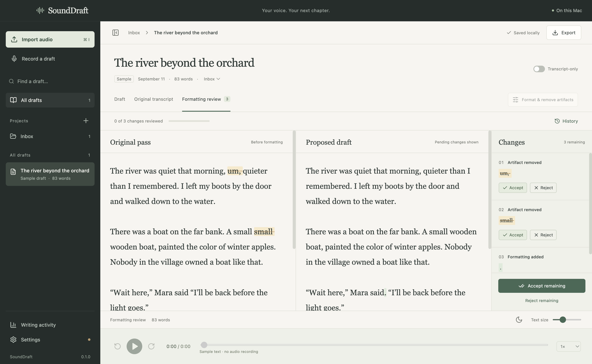

# SoundDraft

A local writing studio for authors who speak their first drafts. Import a recording, transcribe with your own OpenRouter key, and review optional formatting changes beside the original.

[](https://github.com/xavierschwindtwrites-ai/SoundDraft/actions/workflows/check.yml) [](https://github.com/xavierschwindtwrites-ai/SoundDraft/releases/latest) [](LICENSE)

**[Download SoundDraft for Mac](https://github.com/xavierschwindtwrites-ai/SoundDraft/releases/latest)**



macOS 13 Ventura or newer. Choose **arm64** for Apple Silicon (M1/M2/M3/M4 and later), or **x64** for Intel. No Apple Developer membership is needed to build or use these releases. This is an early release; see the testing and limitations below.

## Install

1. Download the `.dmg` for your Mac from Releases.
2. Open it and drag **SoundDraft** into **Applications**.
3. Open SoundDraft. This release is ad-hoc signed, **not Developer ID signed or notarized**, so macOS may block the first launch.
4. After that launch attempt, go to **System Settings → Privacy & Security → Open Anyway** for SoundDraft, then confirm Open. Only do this for a download you trust. Managed Macs may not permit an override.

See [Apple's instructions for opening apps from an unknown developer](https://support.apple.com/guide/mac-help/mh40616/mac). You do not need to disable Gatekeeper globally. A `.zip` download is also available: extract it and move SoundDraft.app into Applications.

## First session

1. Open **Settings** and paste your OpenRouter API key. Remember it with Keychain encryption, or keep it only for the current session.
2. Refresh the model catalog. Choose a transcription model and, optionally, a text model for formatting. Save preferences. `openai/whisper-1` is the initial transcription model; model availability can change.
3. **Import audio** (`⌘I`) and choose **Transcribe**. Imported files are copied into the local library.
4. Read the draft and play the recording. The **Original transcript** tab preserves the original output.
5. Optionally choose **Format & remove artifacts**. Accept or reject each highlighted difference, or accept/reject all remaining changes. Undo decisions while that review remains the current editable version.
6. Export to Word, Markdown, plain text, the original transcript, or full JSON review history. Manuscript exports contain accepted changes only.

Want to look around without a key? Choose **Explore a sample formatting review** on the welcome screen. Sample content is labeled and excluded from activity totals.

## Included

- Local projects, search, editable drafts, autosave, and a previous-library backup.
- Import MP3, M4A, WAV, AAC, FLAC, OGG, WebM, MP4 audio, and AIFF.
- Microphone recording saved incrementally to disk. Stop recording before transcribing.
- Five-minute WAV sections for long audio, with completed sections retained on failure and retry. Provider processing timeouts may still require splitting unusually difficult audio into shorter files.
- Original transcript preservation and separate draft editing.
- **AI Formatting & Artifact Removal**: punctuation, paragraphing, and obvious dictation artifacts. Every actual text difference is displayed; model instructions do not guarantee a perfect edit, so review before accepting.
- Individual and bulk accept/reject, undo, pass metadata, and decision history export.
- **Transcript-only** per draft and project defaults. This disables formatting; transcription still sends audio to OpenRouter.
- Playback speeds, 15-second skip controls, and five-minute section navigation.
- Night reading mode and adjustable manuscript text size.
- Current word counts, reported API spend, and spreadsheet-compatible CSV export.

## Privacy and storage

There is no SoundDraft account, telemetry, automatic sync, or developer API key. Audio is sent to OpenRouter only when you choose Transcribe; draft text is sent only when you request formatting. OpenRouter and its providers have their own processing and retention policies. Model catalogs are fetched only on request.

On macOS, data normally lives in `~/Library/Application Support/SoundDraft/library`. Use **Settings → Show library in Finder** to find the exact folder. The database is an atomically saved JSON file plus a previous-version backup. Audio and text are not encrypted at rest by SoundDraft; FileVault can protect the Mac's disk.

Remembered keys are encrypted with Electron safeStorage backed by macOS Keychain. The encrypted blob is `key.enc` in the library folder; it is excluded from document exports, but included if you manually copy the entire library. Ad-hoc signed updates may prompt for Keychain access again. Session-only keys are forgotten when the app closes.

To back up, quit SoundDraft and copy the library folder. To restore, quit the app, preserve your current library, and replace it with the backup. To recover a corrupt `library.json`, preserve it and copy `library.backup.json` to `library.json`. Keep audio folders together with the database. This first version uses absolute audio paths; moving a library to a different user account may require path migration.

## Current boundaries

This release does **not** include live transcription, waveform editing, collaboration, cloud synchronization, iPhone/iPad apps, or direct Google Sheets/Grok integrations. CSV provides the initial spreadsheet workflow. Jobs run one at a time; importing several files does not automatically submit paid transcription jobs.

Formatting is limited to 60,000 characters per pass. Timestamps are five-minute section boundaries, not word-level alignment. Playback codec support can be narrower than import/transcription support. Recording and transcription accuracy depend on hardware, audio quality, model, and language. Removing files/projects from within the app is not yet included.

## Develop

Requirements: Node.js 22+, npm, macOS with Xcode Command Line Tools (`xcode-select --install`), and internet access to download dependencies and FFmpeg source. A full Xcode installation or paid Apple membership is not required.

```sh
npm ci
npm run build:audio
npm run desktop
```

`npm run dev` serves the frontend shell, but native workflows require `npm run desktop`.

```sh
npm test
npm run test:desktop
npm run build
npm run dist:mac
```

For both architectures from Apple Silicon, build the audio tool for each first:

```sh
npm run build:audio -- arm64
npm run build:audio -- x64
npm run dist:mac
```

Installers are written to `release/`. `npm run dist:dir` creates an unpacked application. Do not commit API keys, personal library files, or recordings.

## Releases on GitHub

The **Build SoundDraft** workflow builds Apple Silicon and Intel installers with no Apple signing secrets. A manual workflow run uploads downloadable build artifacts. Pushing a `v*` tag creates a **draft GitHub release**, which a maintainer reviews and publishes. Set `package.json`'s version to match the tag before release. Tagged releases include SHA-256 checksums.

## Verification

Core tests cover exact diff reconstruction, independent decisions/undo, CSV escaping, interrupted jobs, and corrupt-library preservation. The desktop smoke test covers real Electron rendering, imports and FFmpeg conversion, transcription/formatting against mocked OpenRouter responses, autosave, exports, settings, and restart persistence. It does not spend API credits or prove live model accuracy. Test a short real recording with your own key before committing a long manuscript.

## Third-party software

SoundDraft source is MIT licensed. Electron, React, and other dependencies retain their own licenses. The separately executed FFmpeg audio utility is built from unmodified FFmpeg 8.1.2 source with GPL, nonfree components, network protocols, and external codecs disabled. Its LGPL license, exact source archive, and build configuration are included beside the executable in `SoundDraft.app/Contents/Resources/audio-tools`. See [THIRD_PARTY.md](THIRD_PARTY.md).

API implementation follows [OpenRouter's transcription contract](https://openrouter.ai/blog/tutorials/transcription-on-openrouter/).
